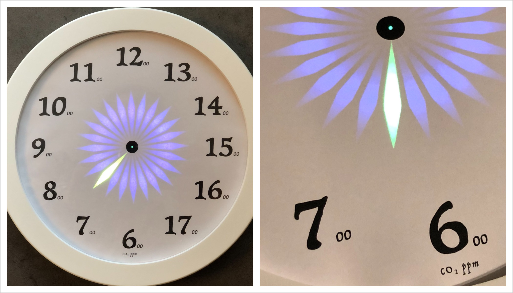
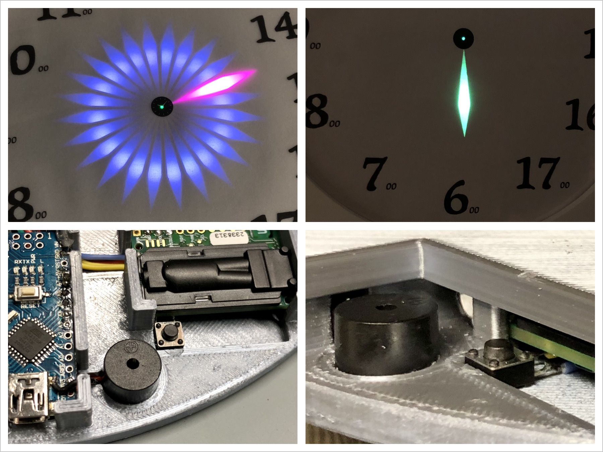
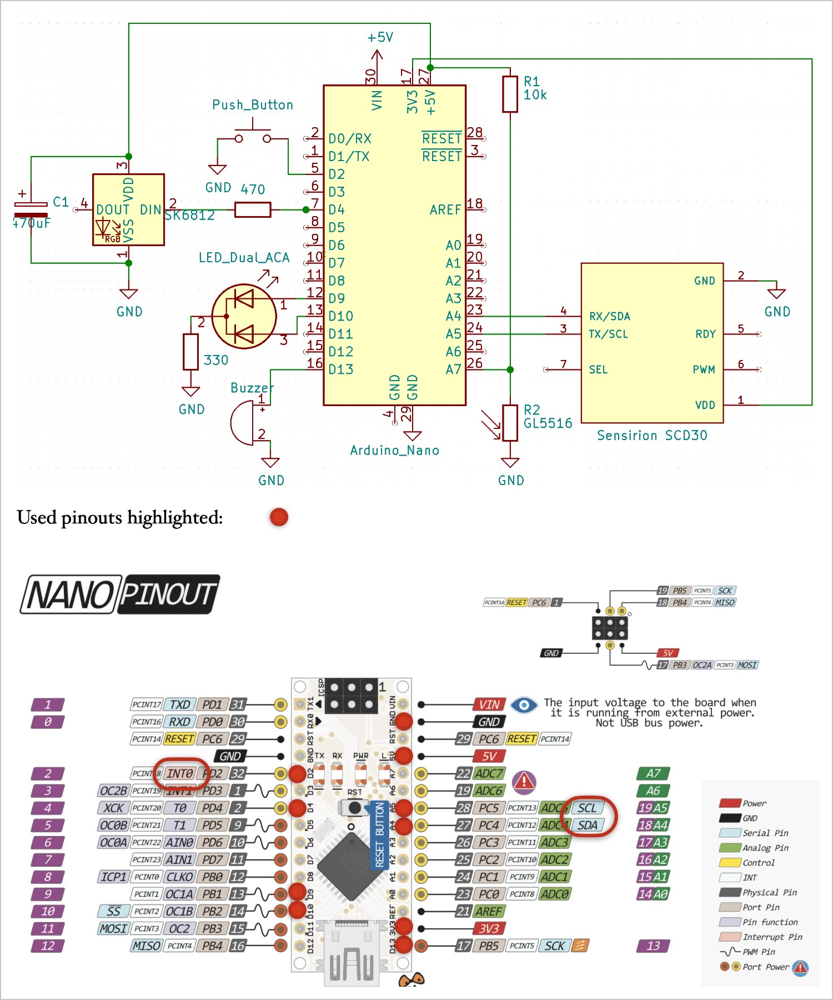
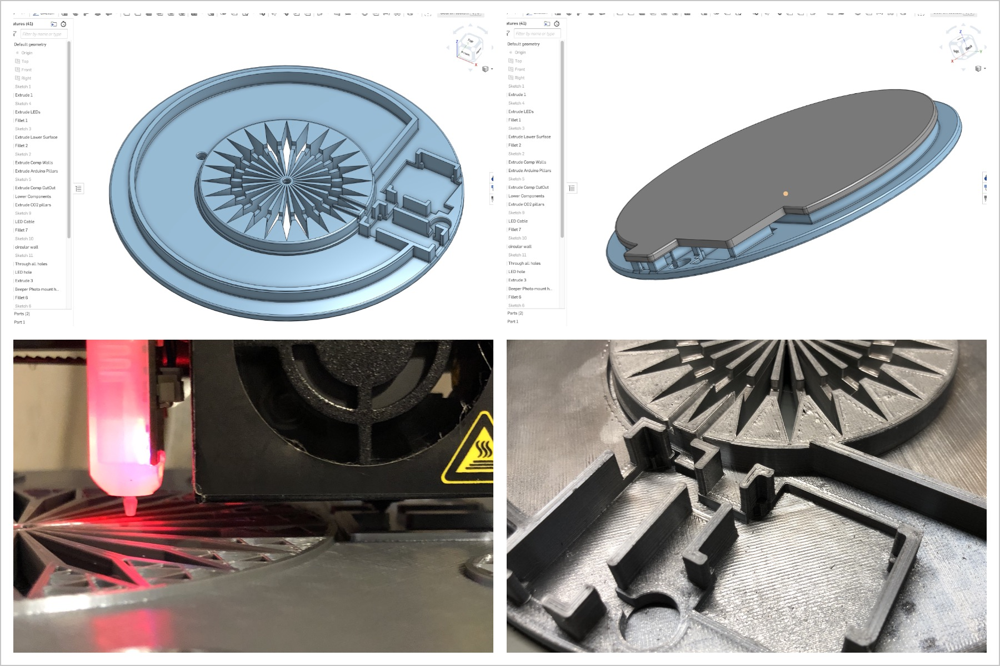
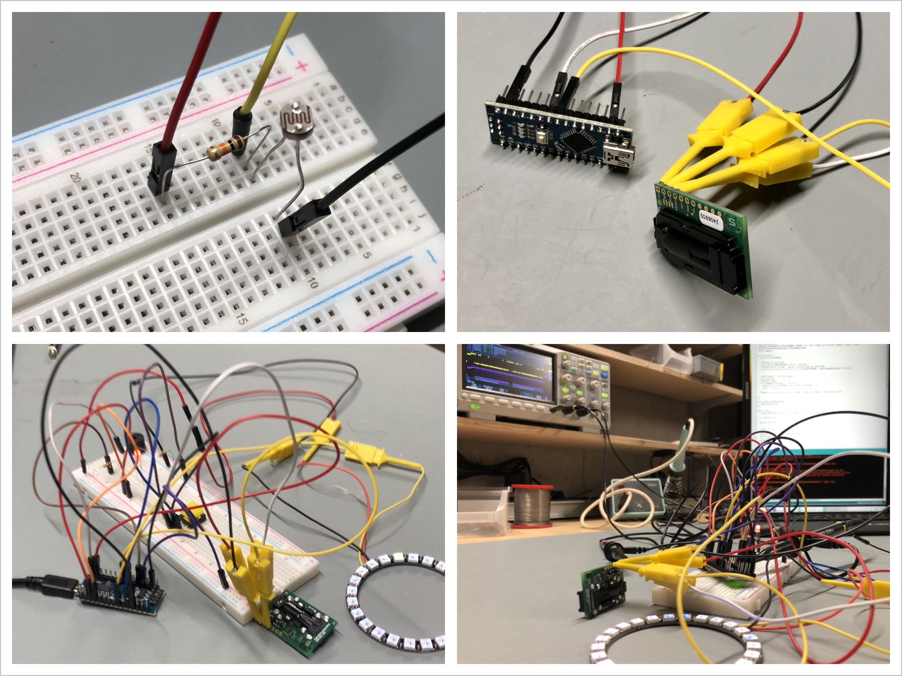

# CO2 Monitor as a Wall Clock
#### Proper airing reduces risk of SARS-CoV-2 infection


## Background
“Aerosols are a possible transmission path of the novel coronavirus. Aerosols spread quickly throughout the entire room, especially in closed indoor spaces. Regular ventilation by shock and cross ventilation or via ventilation systems can significantly reduce the risk of infection with SARS-CoV-2” [1]

Every person is emitting CO2 as well as aerosols while breathing. CO2 concentration correlates with the aerosol and thus virus concentration. CO2 is also a good indicator for the efficiency of the ventilation. 
<p align="center">

</p>
*Modelling Co2 concentration (solid) and virus concentration (dotted) of a classroom with (blue) and without ventilation (yellow).*
[Adapted from http://dx.doi.org/10.14279/depositonce-10362.3](https://depositonce.tu-berlin.de/bitstream/11303/11478.3/9/hartmann_kriegel_2020_en_v3.pdf)

## Why a CO2 Monitor? 
We can all assess and gauge air quality when entering a room (from the outside). However, humans have no means to objectively judge air quality after a short time, given our senses adapt quickly to a situation. [3] Most people do not even notice the incremental worsening of air quality and see no good reason to vent a room often.

Air quality cannot be measured directly, but CO2 concentration is the most important proxy. Outside air has typically CO2 concentration of around 410 ppm. The concentration of exhaled CO2 is in the excess of approx. 38’000 ppm. Indoor CO2 level considered acceptable is 1’000 ppm, a level that is reached in a room quickly. [4]

A CO2 monitor helps to keep a room well-vented and is thought a mandatory utility during the pandemic.

## Design Considerations 
Most CO2 monitors use a (small) digital display that requires your attention to read the CO2 concentration. In this design the concept of a wall clock was chosen for direct visual feedback and intuitive reading. It is well suited for schools, offices and private buildings.

Indoors, concentrations below 600 ppm are of short nature, and exceeding 1’000 ppm suggests inadequate ventilation. Therefore the range from 600-1750 ppm is more than sufficient for indoor operation. 

Moreover, the ppm concentration is color coded and shall relate to the importance to air the room; green-amber-red-purple. 



In the center of the watch face a red/green status LED indicates if a warning buzzer is active or not. If active, the buzzer sends a 50 ms signal every 3 minutes when hitting 1000 ppm, and with increasing concentration warns more often; at 1'750 ppm the buzzer is activated every 10 seconds. 

The buzzer can be turned off/on with a small button that is located nearby the buzzer. Recommen-dation is to keep the buzzer active at all times. 

## Features
- **Accurate:** NDIR CO2 sensor with +/-30ppm +5ppm (calibrated) 
- **Visual:** Display CO2 concentration on a watch face. Range: <=6 to >=17.5 (x100ppm) 
- **Intuitive:** RGB LED relates to CO2 ppm concentration (green-amber-red-purple) 
- **24/7 Operation:** Light sensitive resistor (LDR) adapts brightness of LEDs 
- **Audible:** Integrated buzzer warns when reaching 1000 ppm 
- **Do Not Disturb:** Buzzer can be switched on/off with status LED on watch face

## Parts List (approx. 90-100€)
- Picture Frame (~10€): https://www.amazon.de/dp/B07D4MQ9ZR
- Arduino Nano v3.0 Microcontroller Board (clone) (~6€): https://www.amazon.de/dp/B078SBBST6/
- Sensor: Sensirion SCD 30 (~50€): https://shop.watterott.com/Sensirion-SCD30-CO2-Kohlendioxid-Sensor
- 24 NeoPixel LED ring WS2812 (Adafruit) 5.3 cm (~11€): https://www.amazon.de/dp/B07QLMPV6S
- 3 mm dual color red/green 3 pin LED (Common Cathode LED) (~1€)
- Resistors: 1x 330Ω, 1x470Ω, 1x10kΩ (<1€)
- Capacitor: 470-1000µF/6.3V (<1€)
- Light Sensitive Resistor: 	Light: 20-30 KΩ. Darkness: 1 MΩ (~1€)
- Push Button Switch 6x6mm (<1€)
- Buzzer (<1€)
- Micro USB power supply (~5€)
- PLS or PETG 3D Printed watch face and backdrop (~5€)

## Schematics & Design Considerations
- Button needs to be connected to an Arduino input supporting interrupts (D2 or D3).
- Sensirion SCD 30 can be read-out via PWM, Modbus, or via an I2C bus (used here).
- Data input of Adafruit Neo Pixel LED ring shall be protected with a 470Ω resistor, and DC connection buffered with a 470-1000 µF capacitor. 
- Buzzer is driven directly by low power Arduino output, resulting in a low volume tone. Alternatively a MOSFET driver circuit could be integrated.  




### Arduino Nano Pinout Reference 
- Used pinouts highlighted: 

## 3D CAD Design & 3D Print
- Designed for LEDs to function like an “analogue wach”, hosting all components, while fitting into the picture frame. CO2 sensor mount with open air vents. 
- Design principle: “quick & dirty”, but functional ;)
- Link to my Onshape 3D CAD file: https://cad.onshape.com/documents/eb4fe6fd7e007a0c0a804747/w/9b61381e8207a3fee56fc157/e/aed4f8af9d3ca59d0a31d5e0
- Link to STLs




## Watch Face Design
- Link to pdf
- Best printed on semi-transparent paper; cut-out and place in front of 3D print

## Assembly
It is strongly advised to wire up the components step-by-step, and testing each added functionaly with the debug code snippets in the ino file. After each functional entity is tested, the full assembly is fully operational on a breadboard. At this point the transfer into the 3D printed housing can begin :)  



## Operation

#### Power
The Arduino boad is placed in such a way that the Micro USB connection can be used to power the CO2 Watch 

#### 24/7 Operation
Ambient brightness is measured and LEDs adapt to the given lighting situation, so the CO2 Watch can do its job 24/7.

#### Where to place? 
Install away from windows and  doors and do not place within the proximity of people (>1 m).

## License
This work is licensed under a [Creative Commons Attribution-ShareAlike 4.0 International License](https://creativecommons.org/licenses/by-sa/4.0/legalcode). 

#### You are free to:

- Share — copy and redistribute the material in any medium or format
- Adapt — remix, transform, and build upon the material
- for any purpose, even commercially.

#### Under the following terms:

- Attribution — You must give appropriate credit, provide a link to the license, and indicate if changes were made. You may do so in any reasonable manner, but not in any way that suggests the licensor endorses you or your use.
- ShareAlike — If you remix, transform, or build upon the material, you must distribute your contributions under the same license as the original.

No additional restrictions — You may not apply legal terms or technological measures that legally restrict others from doing anything the license permits.


```markdown
Syntax highlighted code block

# Header 1
## Header 2
### Header 3

- Bulleted
- List

1. Numbered
2. List

**Bold** and _Italic_ and `Code` text

[Link](url) and 
```

For more details see [GitHub Flavored Markdown](https://guides.github.com/features/mastering-markdown/).

### Jekyll Themes

Your Pages site will use the layout and styles from the Jekyll theme you have selected in your [repository settings](https://github.com/markusthemaker/co2watch/settings). The name of this theme is saved in the Jekyll `_config.yml` configuration file.

### Support or Contact

Having trouble with Pages? Check out our [documentation](https://docs.github.com/categories/github-pages-basics/) or [contact support](https://github.com/contact) and we’ll help you sort it out.
